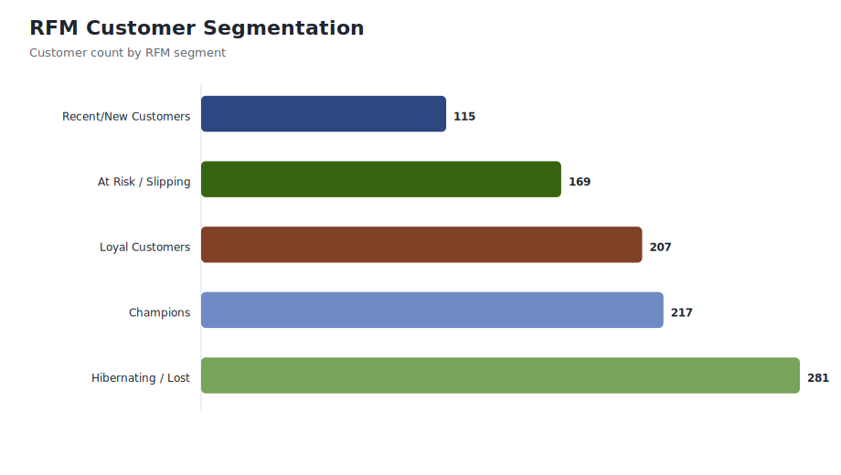
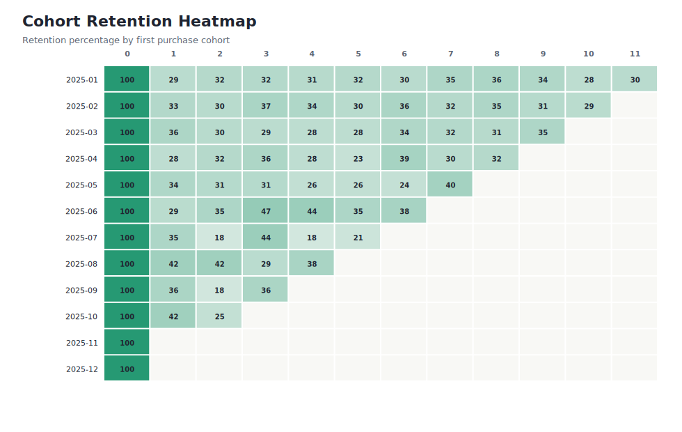

# Customer Behavior and Cohort Retention Dashboard

    
    
    
    

    ## About This Project

    This project analyzes customer behavior with RFM segmentation and cohort retention. It is designed to show how a data analyst can move from transaction logs to segment definitions, churn-risk signals, and retention reporting.

    ## Business Problem

    A customer-driven business needs to know which customers are highly valuable, which customers are slipping, and when retention drops after first purchase. The goal is to support targeted lifecycle marketing and loyalty decisions.

    ## Dashboard Preview

    

    

    ## Data Assets

    | File | Purpose |
    |---|---|
    | `data/raw_customer_orders.csv` | Synthetic raw order data with missing customer IDs and return rows. |
    | `data/cleaned_customer_orders.csv` | Cleaned order-level analytical table. |
    | `data/customer_rfm_segments.csv` | Customer-level RFM scores and segment labels. |
    | `data/customer_cohort_retention_matrix.csv` | Cohort retention matrix by first purchase month. |
    | `docs/data_dictionary.md` | Field definitions for project datasets. |
    | `docs/data_quality_report.md` | Data validation and cleaning summary. |

    ## Key Metrics From Current Data

    | KPI | Value |
    |---|---:|
    | Raw orders | 5,000 |
| Cleaned orders | 4,635 |
| Customers segmented | 989 |
| Total cleaned revenue | $1,099,331 |
| Champions segment customers | 217 |
| Nulls in cleaned orders | 0 |

    ## Technical Workflow

    1. Generate synthetic customer order data in `rfm_and_cohort_analysis.py`.
    2. Remove missing customer identifiers and return/cancellation rows.
    3. Calculate `TotalAmount`, order month, and each customer's first purchase month.
    4. Build RFM scores using quintiles.
    5. Generate segment labels such as Champions, Loyal Customers, At Risk, and Hibernating.
    6. Create a cohort retention matrix for retention diagnostics.

    ## How To Run

    ```bash
    python -m pip install -r requirements.txt
    python rfm_and_cohort_analysis.py
    ```

    ## Repository Structure

    ```text
    data/        Raw, cleaned, RFM, and cohort CSV files
    docs/        Data dictionary and data quality report
    images/      Dashboard preview charts generated from the data
    powerbi/     Dashboard specification, DAX measures, and theme JSON
    sql/         Analytical SQL queries
    ```

    ## Interview Talking Points

    - Shows customer segmentation with RFM scoring.
    - Shows cohort retention logic based on each customer's true first purchase month.
    - Shows lifecycle marketing and churn-risk thinking.
    - Strong supporting project next to the larger SaaS and retail showcase repositories.
